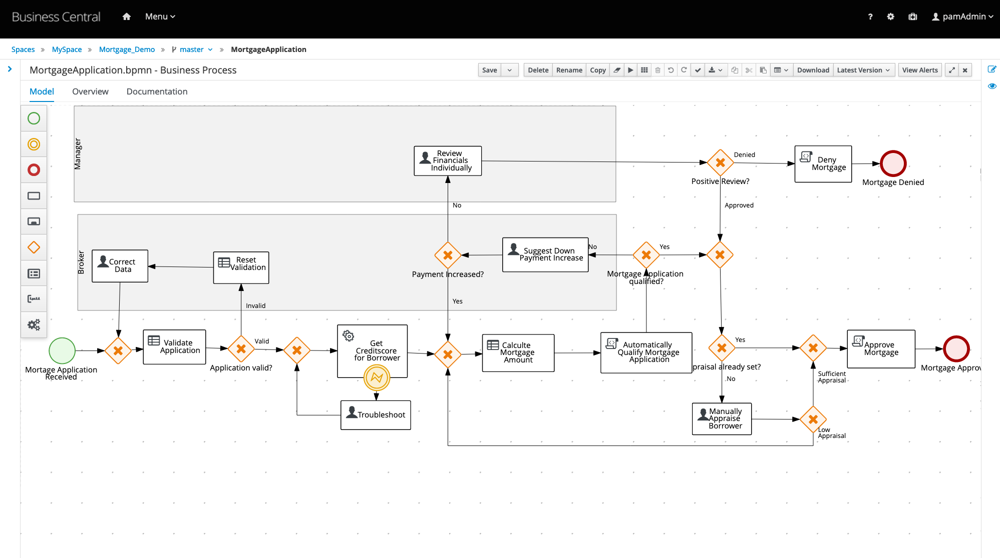
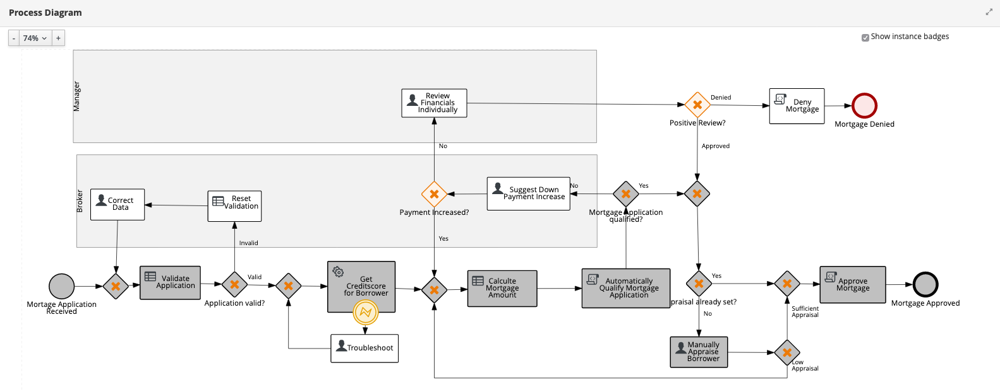

Red Hat Process Automation Manager Mortgage Demo
================================================
This demo project showcases the tooling available in Red Hat Process Automation Manager implementing complex decision 
logic and process automation for a financial mortgage home loan application. The mortgage project in this demo uses 
technical rules, decision tables, guided rules, user tasks, task forms, and process automation  to define its 
mortgage home loan calculations and approval system. You'll be running this demo through the process automation 
business central dashboard.

You can install this project on your own machine or on an OpenShift Container Platform.


Installing on local machine
---------------------------
1. [Download and unzip.](https://github.com/jbossdemocentral/rhpam7-mortgage-demo/archive/master.zip)

2. Add products to installs directory, see installs/README for details and links.

3. Run 'init.sh' or 'init.bat' file. 'init.bat' must be run with Administrative privileges.

Follow install output instructions and log in to http://localhost:8080/business-central (u:dmAdmin / p:redhatpam1!)

Enjoy installed and configured Red Hat Process Automation Manager Mortgage Demo (see below for how to run demo).


Running the demo
----------------
1. Click on the "Mortgage-Demo" project to open the Mortgage Demo project.

2. The project has a data model (Applicant, Application, Appraisal, Property, and ValidationError), 9x guided rules, a 
   mortgage calculation guided decision table, 2x technical rules, 10x task forms, and a mortgage application process.

3. Build and deploy version 1 of the project. Click on the "Build and Deploy" in the upper right corner.

4. Go to "Menu -> Deploy -> Execution Servers" repository to see the mortgage_1 KIE Container deployed on the Process 
   Automation Server.

5. The process server provides a Swagger UI that documents the full RESTful interface exposed by the server at: 
   http://localhost:8080/kie-server/docs, feel free to explore how you can start a process or view the various aspects
   of this project. 

6. Go to "Menu -> Manage -> Process Definitions" to see the MortgageApplication process version 1.0 has been deployed.

7. Click on the process definition line, then start a New Process Instance with button in the top right corner.

8. Fill in the Mortgage Application form as follows and click on Submit button:
   ```
   Name: Eric D. Schabell

   SSN: 123456789

   Annual Income: 90000

   Property Address: somewhere 109

   Sale Price: 200000

   Mortgage Amorization: 30

   Down Payment: 20000
   ```
9. Go to "Menu -> Manage -> Process Instances" and select the process instance listed as running that you just started.
   This give the options to look at Instance Details, Process Variables, Documents, Logs, and Diagrams. Let's look at
   where this process is right now by selecting the Diagrams tab.

10. The red box around the "Manually Appraise Borrower" task means we need to decide if our applicant is to be trusted to
    buy this property, so go to the "Menu -> Manage -> Tasks" and selecting the waiting task.

11. Click on "Claim" button at the bottom followed by clicking on the "Start" task button (standards-based user task
		completion steps mandate these phase labels for tasks) to edit the provided task form field. There is only one field 
    to edit, the Appraised Value so set this property to the esitmated value as follows:
    ```
    Appraised Value: 200000
    ```

12. After submitting the form by clicking on the "Complete" button the task disappears. Go to "Menu -> Manage ->  Process Instances"
		and in the filters panel on the left put a check-box in the "Completed" field to view completed process instances. Find your
    just completed process instance, select it from the list, and open the "Diagram" tab to view the greyed out boxes that depict
    the path taken through this mortgage process. You should see that this mortgage loan request has completed in the "Mortgage
    Approved" final end node of the process.

13. You can play with various values to take different paths through the process while applying for mortgage loans. You can also
    explore, modify rules, redeploy the process, and try any combminations you like. 


Installng on OpenShift Container Platform (CodeReady Containers)
----------------------------------------------------------------
Install this demo on your local machine using an OpenShift Container Platform development cluster can be done using 
CodeReady Continers. It's fully automated and delivers a fully functioning container-native development experience:

[CodeReady Containers Mortgage Demo](https://gitlab.com/redhatdemocentral/crc-mortgage-demo)


Installing on any OpenShift Container Platform (generic)
--------------------------------------------------------
This demo can be installed on your own version of OpenShift Container Platform. Options and guidance can be found 
in [openshift support directory README](support/openshift/README.md).


Notes
-----
The following functionality is covered:

- One advanced process.

- Four Human Tasks assigned to 3 different roles

- Use of Swimlanes to assign a task to the user who previously took ownership

- Several guide business rules

- Several technical rules

- A guided web decision table

- Several Script Tasks for Java work

- Exclusive use of the Red Hat PAM Data Modeler for creating the Java fact model

- Use of graphic form designer to create 4 forms with an example of javascript validation

For 'Appraisal' task only, any claimed tasks that are not competed within a minute will be reassigned automatically back into the group for processing.

Note that the entire demo is running default in memory, restart server, lose your process instances, data, monitoring history.


Supporting Articles
-------------------
- TBD...


Released versions
-----------------
See the tagged releases for the following versions of the product:

- v1.0 - Red Hat Process Automation Manager 7.8.0.GA







